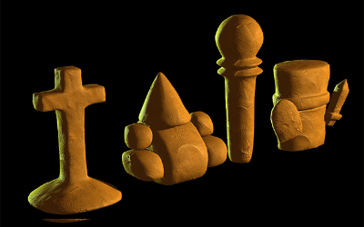
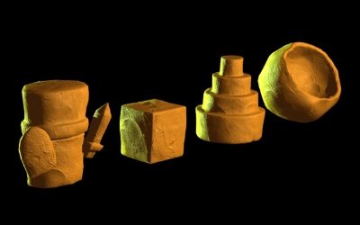
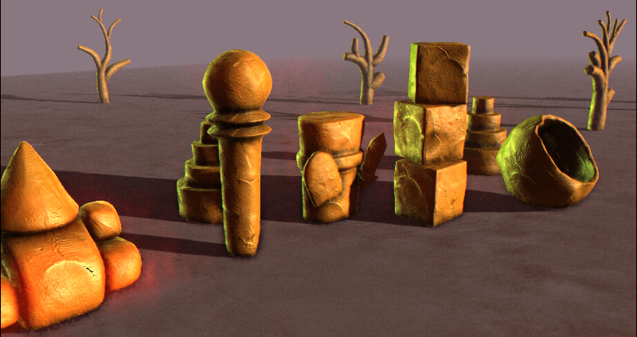
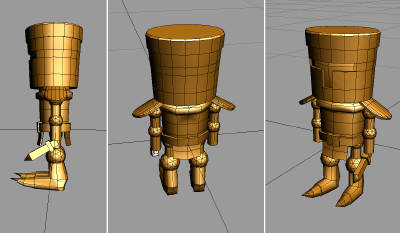
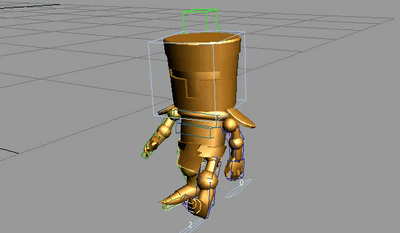
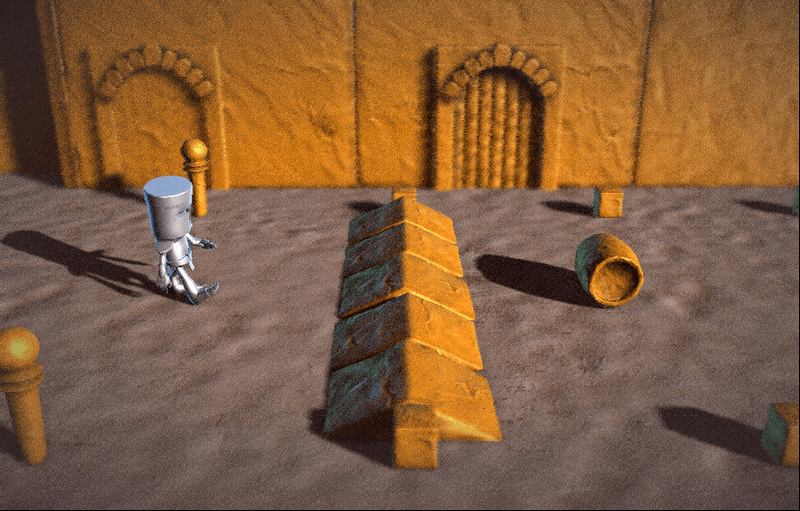

# Mediécross

These are the complete sources to the [TIG Source AGBIC 2010 contest](https://www.tigsource.com/2010/06/28/a-game-by-its-cover-competition/) entry **Mediecross**. The concept of this contest is to implement a complete game, based on one of the imaginary game cartridges found in the [Famicase collection](https://famicase.com/10/index.html).

_I decided to work in this Famicase:_ 

## How to play

Run in a corridor, avoid the obstacles (barrels, slowering tiles...), jump on the bumpers, get the food for extra-time, reach the end of the corridor.

## Credits:
- 3D graphics and game design: [François Gutherz](https://www.github.com/astrofra)
- Code: [Emmanuel Julien](https://github.com/ejulien/)
- Animation: [Ryan Hagen](https://www.behance.net/ryanhagen)
- Music: [Tobyk](https://freesound.org/people/tobyk/) and [Juskiddink](https://freesound.org/people/juskiddink/) on [Freesound.org](https//Freesound.org)

The game is built on top of the [GameStart engine](https://www.youtube.com/@GameStart3D/videos) and entirely implemented in [Squirrel]()

## Screenshots

## Changelog

- Github release on 2023-05-14
- Updated on 2012-12-01, made compatible with the GameStart Beta 2.
- Revision 118
 - Add 3 retries.
 - Add +0.5s bonus when eating meat.
 - Improved the background on level 4.
Revision 110
 - Add score bonus when eating food, malus when hitting barrel.
 - Reduce by a huge amount the UI CPU consumption.
 - Add a bench mode.

## Devlog-ish

The game takes place in a world made of clay, similar to what is shown on the cartridge. The graphic style is all in 3D, trying to mimic the clay atmosphere, as much as possible.

The game design is loosely based on the original arcade game 'Metrocross' by Namco.

 
_My first idea what to get as close as possible of the Famicase cover design._  

_I tried to mimic the look of a series of clay miniatures._  

 
_The finaly animation was done by Ryan Hagen to replace my horrible placeholder walkcycle._  

 
_The whole layout started to appear as soon as I decided to recreate the game design of Metrocross._
