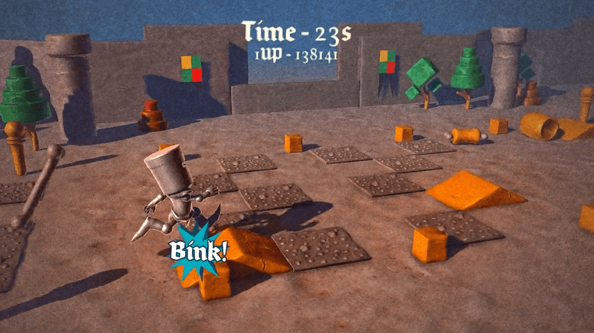
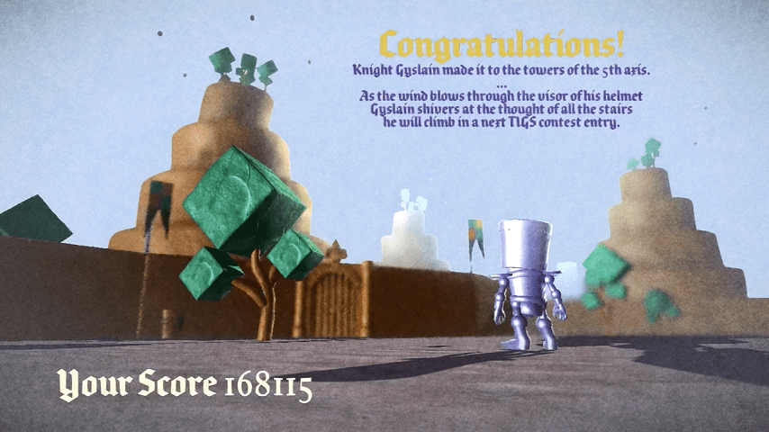

# Mediécross

These are the complete sources to the TIG Source AGBIC contest entry Mediecross.

## Credits:
- 3D graphics and game design: [François Gutherz](https://www.github.com/astrofra)
- Code: Emmanuel Julien
- Animation: [Ryan Hagen](https://www.behance.net/ryanhagen)

The game was done using the GameStart engine (http://www.gamestart3d.com).
This package contains the complete project and sources to run this game using the freeware edition of the GameStart editor.

We hope it can help you to better understand how to make your own projects using GameStart.
Good studying!

## Screenshots

## Changelog

- Updated on 2012-12-01, made compatible with the GameStart Beta 2.

