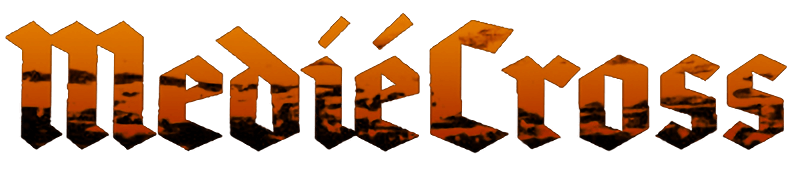
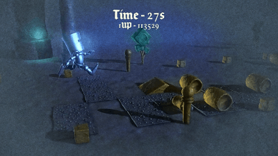

# Mediécross

These are the complete sources to the [TIG Source AGBIC 2010 contest](https://www.tigsource.com/2010/06/28/a-game-by-its-cover-competition/) entry **Mediecross**. The concept of this contest is to implement a complete game, based on one of the imaginary game cartridges found in the [Famicase collection](https://famicase.com/10/index.html).

_I decided to work in this Famicase:_ 

## Credits:
- 3D graphics and game design: [François Gutherz](https://www.github.com/astrofra)
- Code: Emmanuel Julien
- Animation: [Ryan Hagen](https://www.behance.net/ryanhagen)
- Music: [Freesound.org](https//Freesound.org)

The game was done using the [GameStart engine](https://www.youtube.com/@GameStart3D/videos).

## Screenshots

## Changelog

- Updated on 2012-12-01, made compatible with the GameStart Beta 2.

